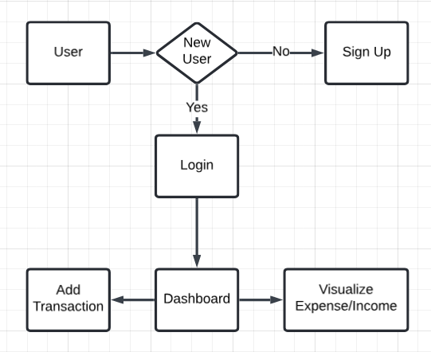

# FinTrack – Personal Finance Tracker Web App

**FinTrack** is a smart, modern web app to track your income and expenses, analyze spending patterns, and stay in control of your finances.

---
## Project Demo
<p align="center">
  
  <br/>
  <b>FinTrack Demo</b>
</p>

## Project Overview

**FinTrack** is a digital finance manager that helps you record, view, and analyze your money flow.

Whether you're a student, a working professional, or just budget-conscious, FinTrack gives you an intuitive way to:

- Add income or expense entries  
- Categorize them  
- View real-time financial analytics  

It works like your personal money diary — **simple, beautiful, and powerful**.

---

## Technical Overview

FinTrack is a full-stack **MERN** application (MongoDB, Express.js, React, Node.js) designed with modern tools for performance and user experience.

**Key Technical Highlights:**

- Fully **responsive UI** built with **Ant Design**  
- **JWT-based authentication** for secure user login  
- **Single Page Application (SPA)** using React  
- Dynamic state updates with Context API  
- Real-time analytics and smart data visualization  
- Modular backend integrated with MongoDB and REST APIs  

---

## Key Features

- **Add / Edit / Delete Transactions**  
- **Filter by Date Range**  
- **Filter by Type** (Income / Expense)  
- **Earnings vs. Expenses Breakdown**  
- **Category-wise Analysis**  
- **User Authentication (Login / Logout)**  
- **Dynamic UI Updates without Page Reloads**  
- **Responsive Design with Ant Design Components**  

---

## Architecture Diagram

<!--  -->
<p align="center">
  
  <br/>
  <b>FinTrack Architecture Diagram</b>
</p>


This diagram shows how the **frontend**, **backend**, **database**, and **authentication system** work together in FinTrack.

---

## Tech Stack

| **Layer**        | **Technology Used**                 | **Purpose**                               |
|------------------|-------------------------------------|--------------------------------------------|
| Frontend         | React.js, Ant Design                | UI, Components, and Styling                |
| Backend          | Node.js, Express.js                 | REST API & Business Logic                  |
| Database         | MongoDB                             | Persistent Storage for Transactions        |
| State Management | React Context API + useReducer      | Global State Handling                      |
| Authentication   | JSON Web Tokens (JWT)               | Secure Login and Session Management        |
| Environment      | dotenv                              | Environment Variable Configuration         |
| Deployment       | Vercel (Frontend), Render (Backend) | App Hosting                                |

---

## Getting Started

### Prerequisites

- **Node.js** v14.6+ (required for ES Modules support)  
- **MongoDB URI**  
- **Git**

---

### Installation

```bash
# 1. Clone the Repository
git clone https://github.com/guptasamarth200/FinTrack.git
cd FinTrack
````

```bash
# 2. Configure Environment Variables
touch .env
```

Add the following inside your `.env` file:

```ini
NODE_ENV=development
PORT=5000
MONGO_URI=your_mongodb_connection_string
```

```bash
# 3. Install Backend Dependencies
npm install
```

```bash
# 4. Move to Frontend and Install Dependencies
cd frontend
npm install
```

---

### Running the Application

**To run both frontend and backend:**

```bash
npm run start
```

**To run backend only:**

```bash
node server.js
```

---

## Build & Deployment

**To create a production build:**

```bash
cd frontend
npm run build
```


---

## Notes

* Backend uses **ES Modules**, so ensure you're using **Node.js v14.6+**
* When importing local files, always include the `.js` extension
* Babel can be added if compatibility with older Node versions is needed

---

## Conclusion

**FinTrack** simplifies personal finance tracking through a clean, modern, and mobile-friendly interface. It’s ideal for anyone looking to understand their **earnings vs. expenses**, control spending habits, and get actionable insights — all in real-time.

---

## License

This project is licensed under the **MIT License**.
See the `LICENSE` file for full details.

---

## Contributing

Contributions are welcome!
Feel free to **open an issue** or **submit a pull request** to help improve the project.

